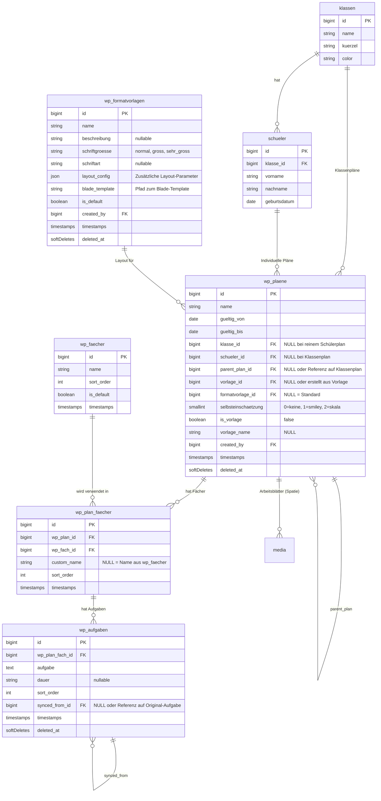
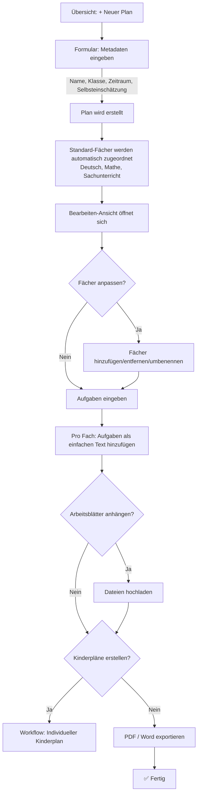
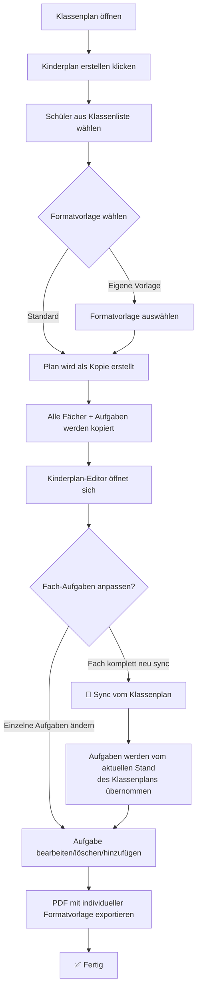
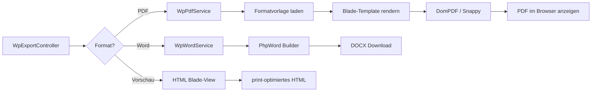
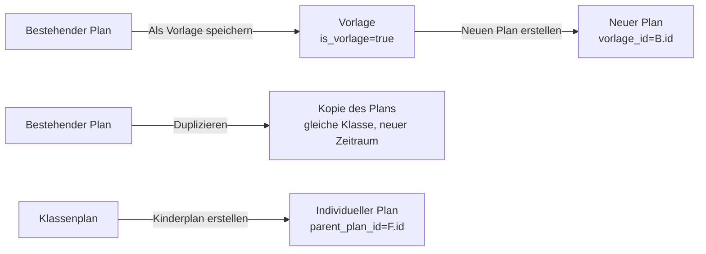

# Konzept: Überarbeitung des Wochenplan-Moduls

> **Version:** 1.0  
> **Datum:** 06.03.2026  
> **Projekt:** MitarbeiterBoard ESZ Radebeul  
> **Stack:** Laravel 10 · Tailwind CSS 4 · Alpine.js 3 · Blade · DomPDF/Snappy

---

## Inhaltsverzeichnis

1. [Zusammenfassung](#1-zusammenfassung)
2. [Ist-Analyse](#2-ist-analyse)
3. [Datenbank-Architektur](#3-datenbank-architektur)
4. [Modelle & Relationen](#4-modelle--relationen)
5. [Controller & Routen](#5-controller--routen)
6. [Frontend-Architektur](#6-frontend-architektur)
7. [Workflow](#7-workflow)
8. [PDF/Export-System](#8-pdfexport-system)
9. [Vorlagen & Kopieren](#9-vorlagen--kopieren)
10. [Berechtigungen](#10-berechtigungen)
11. [Migration](#11-migration)
12. [Phasenplan](#12-phasenplan)
13. [Technische Hinweise](#13-technische-hinweise)

---

## 1. Zusammenfassung

Das bestehende Wochenplan-Modul wird **vollständig ersetzt**. Das neue System ermöglicht Lehrkräften, Wochenpläne schnell und unkompliziert zu erstellen, zu bearbeiten und als PDF/Word zu exportieren.

**Kernziele:**
- **Klassenpläne** für ganze Klassen erstellen
- **Individuelle Kinderpläne** auf Basis von Klassenplänen oder als eigenständige Pläne
- **Fächer** frei wählbar mit sinnvollen Voreinstellungen (Deutsch, Mathe, Sachunterricht)
- **Aufgaben-Synchronisation** vom Klassenplan zum individuellen Kinderplan
- **Flexible Formatvorlagen** für PDF-Export (z.B. größere Schrift für sehbehinderte Kinder)
- **Vorlagen-System** zum Duplizieren und Wiederverwenden von Plänen
- **Entkopplung** vom Group-Modell, direkte Zuordnung zu Klassen und Schülern
- **Frontend** komplett in Tailwind CSS 4 + Alpine.js + Blade

---

## 2. Ist-Analyse

### Bestehendes System

| Komponente | Aktuell | Problem |
|---|---|---|
| **Datenstruktur** | `wochenplaene`, `wprows`, `wp_tasks`, `wps_klassen` | Kein Fächer-Modell, keine Schüler-Zuordnung, an Group gebunden |
| **Controller** | `WochenplanController`, `WpTaskController`, `WPRowsController` | `edit()`, `update()`, `copy()` nur als TODO, nicht implementiert |
| **Frontend** | Bootstrap 4, TinyMCE | Veraltetes UI, unnötig komplexer Rich-Text-Editor |
| **Export** | Nur Word (DOCX) via PhpWord | Kein PDF, kein Browser-Vorschau |
| **Berechtigungen** | `create Wochenplan` (eine Permission) | Zu grob, keine Lese/Schreib-Trennung |
| **Vorlagen** | Nicht vorhanden | Kein Duplizieren, kein Template-System |
| **Individualisierung** | Nicht vorhanden | Keine kindspezifischen Pläne möglich |
| **Formatvorlagen** | Nicht vorhanden | Ein festes Word-Layout für alle |

### Betroffene Dateien (werden ersetzt)

```
app/Models/Wochenplan.php
app/Models/WPRows.php
app/Models/WpTask.php
app/Models/wps_klassen.php
app/Http/Controllers/WochenplanController.php
app/Http/Controllers/WpTaskController.php
app/Http/Controllers/WPRowsController.php
app/Http/Requests/createWPRequest.php
app/Http/Requests/createWPRow.php
app/Http/Requests/createWPTaskRequest.php
resources/views/wochenplan/*.blade.php
database/migrations/2021_04_26_122940_create_wochenplaene_table.php
database/migrations/2021_04_26_124226_create_wprows_table.php
database/migrations/2021_04_26_154634_create_wp_tasks_table.php
database/migrations/2021_09_24_073908_add_duration_field_to_wp_tasks_table.php
```

### Vorhandene Infrastruktur (wird weiterverwendet)

- **Klasse-Modell** (`app/Models/Klasse.php`) – mit `schueler()`-Relation
- **Schueler-Modell** (`app/Models/Schueler.php`) – mit `klasse()`-Relation
- **Spatie Permission** – für Berechtigungssystem
- **Spatie MediaLibrary** – für Dateianhänge (Arbeitsblätter)
- **DomPDF** (`barryvdh/laravel-dompdf`) – für PDF-Generierung
- **Snappy** (`barryvdh/laravel-snappy` + wkhtmltopdf) – für PDF-Generierung
- **PhpWord** (`phpoffice/phpword`) – für Word-Export
- **Tailwind CSS 4** + **Alpine.js 3** – bereits über Vite konfiguriert
- **Vite 7.2** mit `@tailwindcss/vite` Plugin

---

## 3. Datenbank-Architektur

### 3.1 ER-Diagramm



### 3.2 Tabellen-Definitionen

#### `wp_faecher` – Fächerkatalog

| Spalte | Typ | Beschreibung |
|---|---|---|
| `id` | `bigint` PK | Auto-Increment |
| `name` | `string(100)` | Fachname (z.B. "Deutsch", "Mathe") |
| `sort_order` | `integer` | Sortierung (Standard: 0) |
| `is_default` | `boolean` | Wird bei neuen Plänen vorausgewählt |
| `created_at` | `timestamp` | |
| `updated_at` | `timestamp` | |

**Seed-Daten:**
| name | sort_order | is_default |
|---|---|---|
| Deutsch | 1 | true |
| Mathe | 2 | true |
| Sachunterricht | 3 | true |
| Englisch | 4 | false |
| Kunst | 5 | false |
| Musik | 6 | false |
| Sport | 7 | false |
| Ethik/Religion | 8 | false |
| Werken | 9 | false |

#### `wp_plaene` – Wochenpläne (Kern-Tabelle)

| Spalte | Typ | Beschreibung |
|---|---|---|
| `id` | `bigint` PK | Auto-Increment |
| `name` | `string(255)` | Bezeichnung (z.B. "11. WP SJ 2025/2026") |
| `gueltig_von` | `date` | Beginn des Gültigkeitszeitraums |
| `gueltig_bis` | `date` | Ende des Gültigkeitszeitraums |
| `klasse_id` | `bigint` FK nullable | Referenz auf `klassen.id` (bei Klassenplan) |
| `schueler_id` | `bigint` FK nullable | Referenz auf `schueler.id` (bei individuellem Plan) |
| `parent_plan_id` | `bigint` FK nullable | Self-Referenz: Wenn individueller Plan auf Klassenplan basiert |
| `vorlage_id` | `bigint` FK nullable | Aus welcher Vorlage erstellt |
| `formatvorlage_id` | `bigint` FK nullable | Referenz auf `wp_formatvorlagen.id` (NULL = Standard) |
| `selbsteinschaetzung` | `smallInteger` | 0=keine, 1=Smiley, 2=Skala |
| `is_vorlage` | `boolean` | Ist dies eine Vorlage? (default: false) |
| `vorlage_name` | `string` nullable | Name der Vorlage (nur wenn `is_vorlage = true`) |
| `created_by` | `bigint` FK | Referenz auf `users.id` |
| `created_at` | `timestamp` | |
| `updated_at` | `timestamp` | |
| `deleted_at` | `timestamp` nullable | SoftDelete |

**Constraints:**
- CHECK: `klasse_id IS NOT NULL OR schueler_id IS NOT NULL OR is_vorlage = true` — Jeder Plan gehört zu einer Klasse, einem Schüler, oder ist eine Vorlage
- CHECK: `NOT (klasse_id IS NOT NULL AND schueler_id IS NOT NULL)` — Nicht beides gleichzeitig

**Typen:**
- **Klassenplan**: `klasse_id` gesetzt, `schueler_id` NULL
- **Individueller Kinderplan**: `schueler_id` gesetzt, `klasse_id` NULL
- **Vorlage**: `is_vorlage` = true, `klasse_id` und `schueler_id` können NULL sein

#### `wp_plan_faecher` – Fächerzuordnung pro Plan

| Spalte | Typ | Beschreibung |
|---|---|---|
| `id` | `bigint` PK | Auto-Increment |
| `wp_plan_id` | `bigint` FK | Referenz auf `wp_plaene.id` |
| `wp_fach_id` | `bigint` FK | Referenz auf `wp_faecher.id` |
| `custom_name` | `string` nullable | Überschreibt den Fachnamen für diesen Plan |
| `sort_order` | `integer` | Sortierung innerhalb des Plans |
| `created_at` | `timestamp` | |
| `updated_at` | `timestamp` | |

**Unique:** `(wp_plan_id, wp_fach_id)`

#### `wp_aufgaben` – Aufgaben

| Spalte | Typ | Beschreibung |
|---|---|---|
| `id` | `bigint` PK | Auto-Increment |
| `wp_plan_fach_id` | `bigint` FK | Referenz auf `wp_plan_faecher.id` |
| `aufgabe` | `text` | Aufgabentext (einfacher Text, kein HTML) |
| `dauer` | `string(50)` nullable | Zeitvorgabe (z.B. "30 min") |
| `sort_order` | `integer` | Reihenfolge der Aufgaben |
| `synced_from_id` | `bigint` FK nullable | Referenz auf `wp_aufgaben.id` des Quellplans |
| `created_at` | `timestamp` | |
| `updated_at` | `timestamp` | |
| `deleted_at` | `timestamp` nullable | SoftDelete |

**Hinweis zu `synced_from_id`:** Wenn eine Aufgabe vom Klassenplan synchronisiert wurde, wird hier die Original-Aufgabe referenziert. Die Kopie kann danach frei bearbeitet werden. Dies dient nur der Nachverfolgbarkeit.

#### `wp_formatvorlagen` – PDF-Formatvorlagen

| Spalte | Typ | Beschreibung |
|---|---|---|
| `id` | `bigint` PK | Auto-Increment |
| `name` | `string(255)` | Name der Vorlage (z.B. "Standard", "Große Schrift") |
| `beschreibung` | `text` nullable | Beschreibung |
| `schriftgroesse` | `string(20)` | `normal` / `gross` / `sehr_gross` |
| `schriftart` | `string(100)` nullable | CSS Font-Family |
| `layout_config` | `json` | Erweiterte Layout-Parameter |
| `blade_template` | `string(255)` | Blade-Template-Pfad (z.B. `wochenplan.pdf.standard`) |
| `is_default` | `boolean` | Ist dies die Standard-Vorlage? |
| `created_by` | `bigint` FK | Referenz auf `users.id` |
| `created_at` | `timestamp` | |
| `updated_at` | `timestamp` | |
| `deleted_at` | `timestamp` nullable | SoftDelete |

**`layout_config` JSON-Struktur (Beispiel):**
```json
{
  "seitenraender": {
    "oben": 20,
    "unten": 20,
    "links": 15,
    "rechts": 15
  },
  "spalten": {
    "fach_breite": "15%",
    "aufgaben_breite": "55%",
    "check_breite": "5%",
    "unterschrift_breite": "25%"
  },
  "header": {
    "zeige_name_feld": true,
    "zeige_klasse": true,
    "zeige_zeitraum": true
  },
  "footer": {
    "zeige_selbsteinschaetzung": true,
    "zeige_eltern_unterschrift": true,
    "zeige_lehrer_unterschrift": true
  },
  "zeige_dauer_spalte": false
}
```

### 3.3 Migration-Dateien

Alle Migrationen werden als neue Dateien angelegt (bestehendes System bleibt zunächst parallel bestehen):

```
database/migrations/YYYY_MM_DD_000001_create_wp_faecher_table.php
database/migrations/YYYY_MM_DD_000002_create_wp_formatvorlagen_table.php
database/migrations/YYYY_MM_DD_000003_create_wp_plaene_table.php
database/migrations/YYYY_MM_DD_000004_create_wp_plan_faecher_table.php
database/migrations/YYYY_MM_DD_000005_create_wp_aufgaben_table.php
database/migrations/YYYY_MM_DD_000006_seed_wp_default_data.php
database/migrations/YYYY_MM_DD_000007_add_wp_permissions.php
```

---

## 4. Modelle & Relationen

### 4.1 Übersicht

```
app/Models/Wochenplan/
├── WpFach.php
├── WpPlan.php
├── WpPlanFach.php
├── WpAufgabe.php
└── WpFormatvorlage.php
```

### 4.2 `WpFach` – Fächerkatalog

```php
<?php

namespace App\Models\Wochenplan;

use Illuminate\Database\Eloquent\Model;

class WpFach extends Model
{
    protected $table = 'wp_faecher';

    protected $fillable = ['name', 'sort_order', 'is_default'];

    protected $casts = [
        'is_default' => 'boolean',
    ];

    // Fächer die standardmäßig ausgewählt werden
    public function scopeDefault($query)
    {
        return $query->where('is_default', true);
    }

    public function scopeOrdered($query)
    {
        return $query->orderBy('sort_order')->orderBy('name');
    }

    // In welchen Plänen wird dieses Fach verwendet?
    public function planFaecher()
    {
        return $this->hasMany(WpPlanFach::class, 'wp_fach_id');
    }
}
```

### 4.3 `WpPlan` – Wochenplan (Kern-Modell)

```php
<?php

namespace App\Models\Wochenplan;

use App\Models\Klasse;
use App\Models\Schueler;
use App\Models\User;
use Illuminate\Database\Eloquent\Model;
use Illuminate\Database\Eloquent\SoftDeletes;
use Spatie\MediaLibrary\HasMedia;
use Spatie\MediaLibrary\InteractsWithMedia;

class WpPlan extends Model implements HasMedia
{
    use SoftDeletes, InteractsWithMedia;

    protected $table = 'wp_plaene';

    protected $fillable = [
        'name', 'gueltig_von', 'gueltig_bis',
        'klasse_id', 'schueler_id', 'parent_plan_id',
        'vorlage_id', 'formatvorlage_id',
        'selbsteinschaetzung', 'is_vorlage', 'vorlage_name',
        'created_by',
    ];

    protected $casts = [
        'gueltig_von'         => 'date',
        'gueltig_bis'         => 'date',
        'selbsteinschaetzung' => 'integer',
        'is_vorlage'          => 'boolean',
    ];

    // ─── Scopes ──────────────────────────────────────

    public function scopeKlassenplaene($query)
    {
        return $query->whereNotNull('klasse_id')->whereNull('schueler_id')
                     ->where('is_vorlage', false);
    }

    public function scopeSchuelerplaene($query)
    {
        return $query->whereNotNull('schueler_id')->where('is_vorlage', false);
    }

    public function scopeVorlagen($query)
    {
        return $query->where('is_vorlage', true);
    }

    public function scopeAktuell($query)
    {
        return $query->where('gueltig_von', '<=', now())
                     ->where('gueltig_bis', '>=', now());
    }

    public function scopeFuerKlasse($query, $klasseId)
    {
        return $query->where('klasse_id', $klasseId);
    }

    // ─── Relationen ──────────────────────────────────

    public function klasse()
    {
        return $this->belongsTo(Klasse::class, 'klasse_id');
    }

    public function schueler()
    {
        return $this->belongsTo(Schueler::class, 'schueler_id');
    }

    public function parentPlan()
    {
        return $this->belongsTo(self::class, 'parent_plan_id');
    }

    public function kinderPlaene()
    {
        return $this->hasMany(self::class, 'parent_plan_id');
    }

    public function formatvorlage()
    {
        return $this->belongsTo(WpFormatvorlage::class, 'formatvorlage_id');
    }

    public function creator()
    {
        return $this->belongsTo(User::class, 'created_by');
    }

    public function planFaecher()
    {
        return $this->hasMany(WpPlanFach::class, 'wp_plan_id')
                    ->orderBy('sort_order');
    }

    // Alle Aufgaben über die Fächer
    public function aufgaben()
    {
        return $this->hasManyThrough(
            WpAufgabe::class,
            WpPlanFach::class,
            'wp_plan_id',      // FK auf wp_plan_faecher
            'wp_plan_fach_id', // FK auf wp_aufgaben
            'id',              // LK auf wp_plaene
            'id'               // LK auf wp_plan_faecher
        );
    }

    // MediaLibrary: Arbeitsblätter
    public function registerMediaCollections(): void
    {
        $this->addMediaCollection('arbeitsblaetter');
    }

    // ─── Helper ──────────────────────────────────────

    public function isKlassenplan(): bool
    {
        return $this->klasse_id !== null && $this->schueler_id === null;
    }

    public function isSchuelerplan(): bool
    {
        return $this->schueler_id !== null;
    }

    public function isVorlage(): bool
    {
        return $this->is_vorlage;
    }

    public function getTypAttribute(): string
    {
        if ($this->is_vorlage) return 'Vorlage';
        if ($this->schueler_id) return 'Individuell';
        return 'Klassenplan';
    }

    public function getZeitraumAttribute(): string
    {
        return $this->gueltig_von->format('d.m.') . ' - ' .
               $this->gueltig_bis->format('d.m.Y');
    }

    public function getEffectiveFormatvorlage(): WpFormatvorlage
    {
        return $this->formatvorlage
            ?? WpFormatvorlage::where('is_default', true)->first();
    }

    /**
     * Dupliziert diesen Plan (als neuen Plan oder als Vorlage).
     */
    public function duplizieren(array $overrides = []): self
    {
        $neuerPlan = $this->replicate([
            'created_at', 'updated_at', 'deleted_at'
        ]);
        $neuerPlan->fill($overrides);
        $neuerPlan->created_by = auth()->id();
        $neuerPlan->save();

        // Fächer mit Aufgaben kopieren
        foreach ($this->planFaecher as $planFach) {
            $neuesFach = $planFach->replicate();
            $neuesFach->wp_plan_id = $neuerPlan->id;
            $neuesFach->save();

            foreach ($planFach->aufgaben as $aufgabe) {
                $neueAufgabe = $aufgabe->replicate(['deleted_at']);
                $neueAufgabe->wp_plan_fach_id = $neuesFach->id;
                $neueAufgabe->synced_from_id = null;
                $neueAufgabe->save();
            }
        }

        return $neuerPlan;
    }

    /**
     * Erstellt einen individuellen Kinderplan basierend auf diesem Klassenplan.
     */
    public function erstelleSchuelerplan(Schueler $schueler, ?int $formatvorlageId = null): self
    {
        return $this->duplizieren([
            'klasse_id'        => null,
            'schueler_id'      => $schueler->id,
            'parent_plan_id'   => $this->id,
            'is_vorlage'       => false,
            'vorlage_name'     => null,
            'formatvorlage_id' => $formatvorlageId,
            'name'             => $this->name . ' – ' .
                                  $schueler->vorname . ' ' . $schueler->nachname,
        ]);
    }

    /**
     * Synchronisiert die Aufgaben eines bestimmten Fachs vom Parent-Plan.
     * Bestehende Aufgaben des Fachs werden durch die synchronisierten ersetzt.
     */
    public function syncFachVonParent(int $fachId): void
    {
        if (!$this->parent_plan_id) return;

        $parentFach = $this->parentPlan->planFaecher()
            ->where('wp_fach_id', $fachId)->first();

        if (!$parentFach) return;

        $eigeneFach = $this->planFaecher()
            ->where('wp_fach_id', $fachId)->first();

        if (!$eigeneFach) {
            // Fach existiert noch nicht im Kinderplan → anlegen
            $eigeneFach = $parentFach->replicate();
            $eigeneFach->wp_plan_id = $this->id;
            $eigeneFach->save();
        }

        // Bestehende Aufgaben dieses Fachs löschen
        $eigeneFach->aufgaben()->forceDelete();

        // Aufgaben vom Parent kopieren
        foreach ($parentFach->aufgaben as $aufgabe) {
            $neueAufgabe = $aufgabe->replicate(['deleted_at']);
            $neueAufgabe->wp_plan_fach_id = $eigeneFach->id;
            $neueAufgabe->synced_from_id = $aufgabe->id;
            $neueAufgabe->save();
        }
    }
}
```

### 4.4 `WpPlanFach` – Fachzuordnung pro Plan

```php
<?php

namespace App\Models\Wochenplan;

use Illuminate\Database\Eloquent\Model;

class WpPlanFach extends Model
{
    protected $table = 'wp_plan_faecher';

    protected $fillable = ['wp_plan_id', 'wp_fach_id', 'custom_name', 'sort_order'];

    public function plan()
    {
        return $this->belongsTo(WpPlan::class, 'wp_plan_id');
    }

    public function fach()
    {
        return $this->belongsTo(WpFach::class, 'wp_fach_id');
    }

    public function aufgaben()
    {
        return $this->hasMany(WpAufgabe::class, 'wp_plan_fach_id')
                    ->orderBy('sort_order');
    }

    /**
     * Gibt den Anzeigenamen zurück (custom_name oder Fachname).
     */
    public function getDisplayNameAttribute(): string
    {
        return $this->custom_name ?? $this->fach->name;
    }
}
```

### 4.5 `WpAufgabe` – Aufgabe

```php
<?php

namespace App\Models\Wochenplan;

use Illuminate\Database\Eloquent\Model;
use Illuminate\Database\Eloquent\SoftDeletes;

class WpAufgabe extends Model
{
    use SoftDeletes;

    protected $table = 'wp_aufgaben';

    protected $fillable = [
        'wp_plan_fach_id', 'aufgabe', 'dauer',
        'sort_order', 'synced_from_id',
    ];

    public function planFach()
    {
        return $this->belongsTo(WpPlanFach::class, 'wp_plan_fach_id');
    }

    public function syncedFrom()
    {
        return $this->belongsTo(self::class, 'synced_from_id');
    }

    /**
     * Wurde diese Aufgabe vom Elternplan synchronisiert?
     */
    public function isSynced(): bool
    {
        return $this->synced_from_id !== null;
    }
}
```

### 4.6 `WpFormatvorlage` – PDF-Formatvorlage

```php
<?php

namespace App\Models\Wochenplan;

use App\Models\User;
use Illuminate\Database\Eloquent\Model;
use Illuminate\Database\Eloquent\SoftDeletes;

class WpFormatvorlage extends Model
{
    use SoftDeletes;

    protected $table = 'wp_formatvorlagen';

    protected $fillable = [
        'name', 'beschreibung', 'schriftgroesse',
        'schriftart', 'layout_config', 'blade_template',
        'is_default', 'created_by',
    ];

    protected $casts = [
        'layout_config' => 'array',
        'is_default'    => 'boolean',
    ];

    public function creator()
    {
        return $this->belongsTo(User::class, 'created_by');
    }

    public function plaene()
    {
        return $this->hasMany(WpPlan::class, 'formatvorlage_id');
    }

    /**
     * Gibt die CSS-Klasse für die Schriftgröße zurück.
     */
    public function getSchriftgroesseCssAttribute(): string
    {
        return match ($this->schriftgroesse) {
            'gross'      => 'text-lg',
            'sehr_gross' => 'text-xl',
            default      => 'text-sm',
        };
    }

    /**
     * Gibt den Layout-Config-Wert oder Fallback zurück.
     */
    public function config(string $key, mixed $default = null): mixed
    {
        return data_get($this->layout_config, $key, $default);
    }
}
```

### 4.7 Ergänzungen an bestehenden Modellen

**`app/Models/Klasse.php`** – Neue Relation:
```php
public function wpPlaene()
{
    return $this->hasMany(\App\Models\Wochenplan\WpPlan::class, 'klasse_id');
}
```

**`app/Models/Schueler.php`** – Neue Relation:
```php
public function wpPlaene()
{
    return $this->hasMany(\App\Models\Wochenplan\WpPlan::class, 'schueler_id');
}
```

---

## 5. Controller & Routen

### 5.1 Controller-Struktur

```
app/Http/Controllers/Wochenplan/
├── WpPlanController.php          # CRUD für Wochenpläne
├── WpAufgabeController.php       # CRUD für Aufgaben
├── WpFachController.php          # Fächer-Verwaltung (Admin)
├── WpExportController.php        # PDF/Word-Export
├── WpVorlageController.php       # Vorlagen-Verwaltung
├── WpFormatvorlageController.php # Formatvorlagen-Verwaltung
└── WpSyncController.php          # Aufgaben-Synchronisation
```

### 5.2 Routen-Definition

```php
// routes/web.php

use App\Http\Controllers\Wochenplan\WpPlanController;
use App\Http\Controllers\Wochenplan\WpAufgabeController;
use App\Http\Controllers\Wochenplan\WpFachController;
use App\Http\Controllers\Wochenplan\WpExportController;
use App\Http\Controllers\Wochenplan\WpVorlageController;
use App\Http\Controllers\Wochenplan\WpFormatvorlageController;
use App\Http\Controllers\Wochenplan\WpSyncController;

Route::middleware(['auth', 'permission:view wochenplan'])->prefix('wp')->name('wp.')->group(function () {

    // ─── Wochenpläne (Klassenpläne) ──────────────────
    Route::get('/', [WpPlanController::class, 'index'])->name('index');
    Route::get('/klasse/{klasse}', [WpPlanController::class, 'indexKlasse'])->name('klasse');

    Route::middleware('permission:create wochenplan')->group(function () {
        // Neuen Plan erstellen
        Route::get('/create', [WpPlanController::class, 'create'])->name('create');
        Route::post('/', [WpPlanController::class, 'store'])->name('store');

        // Plan bearbeiten
        Route::get('/{wpPlan}/edit', [WpPlanController::class, 'edit'])->name('edit');
        Route::put('/{wpPlan}', [WpPlanController::class, 'update'])->name('update');
        Route::delete('/{wpPlan}', [WpPlanController::class, 'destroy'])->name('destroy');

        // Plan duplizieren
        Route::post('/{wpPlan}/duplizieren', [WpPlanController::class, 'duplizieren'])->name('duplizieren');

        // Individuellen Kinderplan erstellen
        Route::get('/{wpPlan}/schueler-plan/create', [WpPlanController::class, 'createSchuelerplan'])->name('schuelerplan.create');
        Route::post('/{wpPlan}/schueler-plan', [WpPlanController::class, 'storeSchuelerplan'])->name('schuelerplan.store');

        // ─── Aufgaben ────────────────────────────────
        Route::post('/fach/{wpPlanFach}/aufgabe', [WpAufgabeController::class, 'store'])->name('aufgabe.store');
        Route::put('/aufgabe/{wpAufgabe}', [WpAufgabeController::class, 'update'])->name('aufgabe.update');
        Route::delete('/aufgabe/{wpAufgabe}', [WpAufgabeController::class, 'destroy'])->name('aufgabe.destroy');
        Route::post('/aufgabe/reorder', [WpAufgabeController::class, 'reorder'])->name('aufgabe.reorder');

        // ─── Fächer im Plan ──────────────────────────
        Route::post('/{wpPlan}/fach', [WpPlanController::class, 'addFach'])->name('fach.add');
        Route::delete('/plan-fach/{wpPlanFach}', [WpPlanController::class, 'removeFach'])->name('fach.remove');
        Route::post('/plan-fach/reorder', [WpPlanController::class, 'reorderFaecher'])->name('fach.reorder');

        // ─── Synchronisation ─────────────────────────
        Route::post('/{wpPlan}/sync/{fachId}', [WpSyncController::class, 'syncFach'])->name('sync.fach');
        Route::post('/{wpPlan}/sync-all', [WpSyncController::class, 'syncAll'])->name('sync.all');

        // ─── Arbeitsblätter (Media) ──────────────────
        Route::post('/{wpPlan}/media', [WpPlanController::class, 'addMedia'])->name('media.store');
        Route::delete('/media/{media}', [WpPlanController::class, 'removeMedia'])->name('media.destroy');
    });

    // ─── Export ──────────────────────────────────────
    Route::get('/{wpPlan}/pdf', [WpExportController::class, 'pdf'])->name('export.pdf');
    Route::get('/{wpPlan}/word', [WpExportController::class, 'word'])->name('export.word');
    Route::get('/{wpPlan}/vorschau', [WpExportController::class, 'vorschau'])->name('export.vorschau');

    // ─── Vorlagen ────────────────────────────────────
    Route::middleware('permission:create wochenplan')->prefix('vorlagen')->name('vorlagen.')->group(function () {
        Route::get('/', [WpVorlageController::class, 'index'])->name('index');
        Route::post('/{wpPlan}/als-vorlage', [WpVorlageController::class, 'alsVorlageSpeichern'])->name('save');
        Route::post('/{wpPlan}/von-vorlage', [WpVorlageController::class, 'vonVorlageErstellen'])->name('create');
        Route::delete('/{wpPlan}', [WpVorlageController::class, 'destroy'])->name('destroy');
    });

    // ─── Formatvorlagen (Admin) ──────────────────────
    Route::middleware('permission:manage wochenplan-formatvorlagen')->prefix('formatvorlagen')->name('formatvorlagen.')->group(function () {
        Route::get('/', [WpFormatvorlageController::class, 'index'])->name('index');
        Route::get('/create', [WpFormatvorlageController::class, 'create'])->name('create');
        Route::post('/', [WpFormatvorlageController::class, 'store'])->name('store');
        Route::get('/{wpFormatvorlage}/edit', [WpFormatvorlageController::class, 'edit'])->name('edit');
        Route::put('/{wpFormatvorlage}', [WpFormatvorlageController::class, 'update'])->name('update');
        Route::delete('/{wpFormatvorlage}', [WpFormatvorlageController::class, 'destroy'])->name('destroy');
        Route::get('/{wpFormatvorlage}/vorschau', [WpFormatvorlageController::class, 'vorschau'])->name('vorschau');
    });

    // ─── Fächer-Katalog (Admin) ──────────────────────
    Route::middleware('permission:manage wochenplan-faecher')->prefix('faecher')->name('faecher.')->group(function () {
        Route::get('/', [WpFachController::class, 'index'])->name('index');
        Route::post('/', [WpFachController::class, 'store'])->name('store');
        Route::put('/{wpFach}', [WpFachController::class, 'update'])->name('update');
        Route::delete('/{wpFach}', [WpFachController::class, 'destroy'])->name('destroy');
    });
});
```

### 5.3 Controller-Methoden (Übersicht)

#### `WpPlanController`

| Methode | Route | Beschreibung |
|---|---|---|
| `index()` | `GET /wp` | Übersicht aller Pläne (filterbar nach Klasse, Zeitraum) |
| `indexKlasse($klasse)` | `GET /wp/klasse/{klasse}` | Pläne einer bestimmten Klasse |
| `create()` | `GET /wp/create` | Formular: neuen Plan anlegen |
| `store(Request)` | `POST /wp` | Plan speichern |
| `edit($wpPlan)` | `GET /wp/{wpPlan}/edit` | Plan bearbeiten (Hauptansicht) |
| `update(Request, $wpPlan)` | `PUT /wp/{wpPlan}` | Plan-Metadaten aktualisieren |
| `destroy($wpPlan)` | `DELETE /wp/{wpPlan}` | Plan löschen (SoftDelete) |
| `duplizieren($wpPlan)` | `POST /wp/{wpPlan}/duplizieren` | Plan inkl. Fächer/Aufgaben duplizieren |
| `createSchuelerplan($wpPlan)` | `GET /wp/{wpPlan}/schueler-plan/create` | Schüler auswählen für Kinderplan |
| `storeSchuelerplan(Request, $wpPlan)` | `POST /wp/{wpPlan}/schueler-plan` | Kinderplan erstellen |
| `addFach(Request, $wpPlan)` | `POST /wp/{wpPlan}/fach` | Fach zum Plan hinzufügen |
| `removeFach($wpPlanFach)` | `DELETE /wp/plan-fach/{id}` | Fach aus Plan entfernen |
| `addMedia(Request, $wpPlan)` | `POST /wp/{wpPlan}/media` | Arbeitsblatt hochladen |
| `removeMedia($media)` | `DELETE /wp/media/{id}` | Arbeitsblatt entfernen |

#### `WpAufgabeController`

| Methode | Route | Beschreibung |
|---|---|---|
| `store(Request, $wpPlanFach)` | `POST /wp/fach/{id}/aufgabe` | Aufgabe erstellen |
| `update(Request, $wpAufgabe)` | `PUT /wp/aufgabe/{id}` | Aufgabe bearbeiten |
| `destroy($wpAufgabe)` | `DELETE /wp/aufgabe/{id}` | Aufgabe löschen |
| `reorder(Request)` | `POST /wp/aufgabe/reorder` | Reihenfolge per Drag&Drop |

#### `WpExportController`

| Methode | Route | Beschreibung |
|---|---|---|
| `pdf($wpPlan)` | `GET /wp/{id}/pdf` | PDF-Download/-Anzeige im Browser |
| `word($wpPlan)` | `GET /wp/{id}/word` | Word-Download |
| `vorschau($wpPlan)` | `GET /wp/{id}/vorschau` | HTML-Druckvorschau im Browser |

---

## 6. Frontend-Architektur

### 6.1 Technologie

| Technologie | Version | Einsatz |
|---|---|---|
| **Tailwind CSS** | 4.0 | Styling aller Wochenplan-Views |
| **Alpine.js** | 3.15 | Interaktive Elemente (Modals, Drag&Drop, Tabs) |
| **Blade** | Laravel 10 | Serverseitiges Templating |
| **Vite** | 7.2 | Build-Tool |

> **Kein Bootstrap** in neuen Wochenplan-Views. Tailwind's Preflight bleibt global deaktiviert (wg. Bootstrap-Kompatibilität), daher ggf. eigene Resets im Wochenplan-CSS.

### 6.2 Dateistruktur

```
resources/
├── css/
│   └── wochenplan.css              # Tailwind-Einstiegspunkt
├── js/
│   └── wochenplan.js               # Alpine.js Komponenten
└── views/
    └── wochenplan/
        ├── index.blade.php          # Übersicht aller Pläne
        ├── create.blade.php         # Neuen Plan erstellen
        ├── edit.blade.php           # Plan bearbeiten (Hauptansicht)
        ├── show.blade.php           # Plan-Detailansicht (readonly)
        │
        ├── components/
        │   ├── plan-header.blade.php      # Header mit Metadaten
        │   ├── fach-row.blade.php         # Fach-Zeile mit Aufgaben
        │   ├── aufgabe-item.blade.php     # Einzelne Aufgabe
        │   ├── aufgabe-form.blade.php     # Inline-Formular für Aufgabe
        │   ├── fach-selector.blade.php    # Fach-Auswahl-Dropdown
        │   ├── schueler-selector.blade.php # Schüler-Auswahl
        │   ├── media-upload.blade.php     # Arbeitsblatt-Upload
        │   ├── sync-badge.blade.php       # Sync-Status-Badge
        │   └── plan-card.blade.php        # Plan-Karte für Übersicht
        │
        ├── schuelerplan/
        │   ├── create.blade.php     # Schüler wählen + Optionen
        │   └── edit.blade.php       # Individuellen Plan bearbeiten
        │
        ├── vorlagen/
        │   └── index.blade.php      # Vorlagen-Übersicht
        │
        ├── formatvorlagen/
        │   ├── index.blade.php      # Formatvorlagen-Übersicht
        │   ├── create.blade.php     # Neue Formatvorlage
        │   └── edit.blade.php       # Formatvorlage bearbeiten
        │
        ├── faecher/
        │   └── index.blade.php      # Fächer-Verwaltung
        │
        ├── export/
        │   └── vorschau.blade.php   # Druckvorschau (HTML)
        │
        └── pdf/
            ├── standard.blade.php         # Standard-PDF-Template
            ├── gross.blade.php            # Große Schrift Template
            └── individuell.blade.php      # Individuelles Layout
```

### 6.3 Vite-Konfiguration (Ergänzung)

Neue Eintrittspunkte für das Wochenplan-Modul:

```javascript
// vite.config.js – input-Array ergänzen um:
'resources/css/wochenplan.css',
'resources/js/wochenplan.js',
```

```javascript
// refresh-Array ergänzen um:
'resources/views/wochenplan/**/*.blade.php',
```

### 6.4 Tailwind-Konfiguration (Ergänzung)

```javascript
// tailwind.config.js – content-Array ergänzen um:
"./resources/views/wochenplan/**/*.blade.php",
"./resources/js/wochenplan.js",
```

### 6.5 View-Beschreibungen

#### `index.blade.php` – Übersicht

```
┌─────────────────────────────────────────────────────────┐
│  Wochenpläne                         [+ Neuer Plan]     │
├─────────────────────────────────────────────────────────┤
│  Filter: [Klasse ▼] [Zeitraum ▼] [Typ ▼] [Suche...]   │
├─────────────────────────────────────────────────────────┤
│  Tabs: [Aktuelle] [Vergangene] [Vorlagen]               │
├─────────────────────────────────────────────────────────┤
│  ┌──────────────────────────────────────────────┐       │
│  │ 📋 11. WP SJ 2025/2026                      │       │
│  │ Klasse 4 · 09.03. - 20.03.2026              │       │
│  │ 3 Fächer · 12 Aufgaben · 2 Kinderpläne      │       │
│  │ [Bearbeiten] [PDF] [Duplizieren] [Löschen]  │       │
│  └──────────────────────────────────────────────┘       │
│  ┌──────────────────────────────────────────────┐       │
│  │ 📋 11. WP – Nele Müller (individuell)        │       │
│  │ Klasse 4 · 09.03. - 20.03.2026              │       │
│  │ Basiert auf: 11. WP SJ 2025/2026            │       │
│  │ [Bearbeiten] [PDF] [Löschen]                │       │
│  └──────────────────────────────────────────────┘       │
│                                                         │
│  Seite 1 von 3  [< 1 2 3 >]                           │
└─────────────────────────────────────────────────────────┘
```

#### `edit.blade.php` – Plan bearbeiten (Hauptansicht)

```
┌─────────────────────────────────────────────────────────┐
│  ← Zurück    11. WP SJ 2025/2026         [Speichern]   │
│              Klasse 4 · 09.03.-20.03.2026               │
├─────────────────────────────────────────────────────────┤
│  Metadaten: [Name] [Von] [Bis] [Selbsteinschätzung ▼]  │
│  Formatvorlage: [Standard ▼]                            │
├─────────────────────────────────────────────────────────┤
│  Aktionen: [📄 PDF] [📝 Word] [📋 Duplizieren]         │
│            [👤 Kinderplan erstellen] [📎 Arbeitsblatt]  │
├─────────────────────────────────────────────────────────┤
│                                                         │
│  ┌─ Deutsch ──────────────────────── [↕] [🗑️] ──┐      │
│  │  □ S. 45, Nr. 1-3 bearbeiten        [✏️] [🗑️]│      │
│  │  □ Lernwörter 3x abschreiben        [✏️] [🗑️]│      │
│  │  □ Lesetext "Der Frühling" lesen     [✏️] [🗑️]│      │
│  │  [+ Aufgabe hinzufügen]                       │      │
│  └────────────────────────────────────────────────┘     │
│                                                         │
│  ┌─ Mathe ────────────────────────── [↕] [🗑️] ──┐      │
│  │  □ AH S. 32, alle Aufgaben          [✏️] [🗑️]│      │
│  │  □ 1x1-Reihen üben (6er, 7er)       [✏️] [🗑️]│      │
│  │  [+ Aufgabe hinzufügen]                       │      │
│  └────────────────────────────────────────────────┘     │
│                                                         │
│  ┌─ Sachunterricht ──────────────── [↕] [🗑️] ──┐       │
│  │  □ Steckbrief Frühblüher            [✏️] [🗑️]│      │
│  │  [+ Aufgabe hinzufügen]                       │      │
│  └────────────────────────────────────────────────┘     │
│                                                         │
│  [+ Fach hinzufügen ▼]                                  │
│                                                         │
│  ── Arbeitsblätter ─────────────────────────────────    │
│  📎 AB_Frühblüher.pdf (120 KB)              [🗑️]       │
│  📎 Mathe_Übung_1x1.pdf (85 KB)             [🗑️]       │
│  [+ Datei hochladen]                                    │
│                                                         │
│  ── Individuelle Kinderpläne ───────────────────────    │
│  👤 Nele Müller – eigene Formatvorlage     [Öffnen]    │
│  👤 Max Schmidt – Standard                 [Öffnen]    │
│  [+ Kinderplan erstellen]                               │
└─────────────────────────────────────────────────────────┘
```

#### `schuelerplan/edit.blade.php` – Individuellen Kinderplan bearbeiten

```
┌─────────────────────────────────────────────────────────┐
│  ← Zurück zum Klassenplan                               │
│  11. WP – Nele Müller (individuell)       [Speichern]   │
│  Basiert auf: 11. WP SJ 2025/2026                       │
├─────────────────────────────────────────────────────────┤
│  Formatvorlage: [Große Schrift ▼]                       │
├─────────────────────────────────────────────────────────┤
│                                                         │
│  ┌─ Deutsch ────────────── [🔄 Vom Klassenplan sync] ─┐ │
│  │  □ S. 45, Nr. 1 bearbeiten (angepasst) [✏️] [🗑️]  │ │
│  │  □ Lernwörter 2x abschreiben           [✏️] [🗑️]  │ │
│  │  [+ Aufgabe hinzufügen]                             │ │
│  └─────────────────────────────────────────────────────┘ │
│                                                         │
│  ┌─ Mathe ──────────────── [🔄 Vom Klassenplan sync] ─┐ │
│  │  🔗 AH S. 32, Aufgabe 1-3 (synced)    [✏️] [🗑️]  │ │
│  │  □ Zusatzaufgabe: Zahlenstrahl          [✏️] [🗑️]  │ │
│  │  [+ Aufgabe hinzufügen]                             │ │
│  └─────────────────────────────────────────────────────┘ │
│                                                         │
└─────────────────────────────────────────────────────────┘
```

### 6.6 Alpine.js Komponenten

```javascript
// resources/js/wochenplan.js

import Alpine from 'alpinejs';
import collapse from '@alpinejs/collapse';

Alpine.plugin(collapse);

// Inline-Aufgabenbearbeitung
Alpine.data('aufgabeForm', () => ({
    editing: false,
    aufgabe: '',
    dauer: '',

    startEdit(text, dauer) {
        this.aufgabe = text;
        this.dauer = dauer || '';
        this.editing = true;
        this.$nextTick(() => this.$refs.input?.focus());
    },

    cancel() {
        this.editing = false;
    }
}));

// Fach-Auswahl mit Dropdown
Alpine.data('fachSelector', () => ({
    open: false,
    search: '',
    faecher: [],

    init() {
        this.faecher = JSON.parse(this.$el.dataset.faecher || '[]');
    },

    get filtered() {
        return this.faecher.filter(f =>
            f.name.toLowerCase().includes(this.search.toLowerCase())
        );
    }
}));

// Drag & Drop für Aufgaben-Reihenfolge
Alpine.data('sortable', () => ({
    dragging: null,

    dragStart(e, id) {
        this.dragging = id;
        e.dataTransfer.effectAllowed = 'move';
    },

    dragOver(e) {
        e.preventDefault();
    },

    async drop(e, targetId) {
        e.preventDefault();
        if (this.dragging === targetId) return;

        // POST an reorder-Route
        const response = await fetch(this.$el.dataset.reorderUrl, {
            method: 'POST',
            headers: {
                'Content-Type': 'application/json',
                'X-CSRF-TOKEN': document.querySelector('meta[name="csrf-token"]').content,
            },
            body: JSON.stringify({
                source: this.dragging,
                target: targetId,
            }),
        });

        if (response.ok) {
            window.location.reload();
        }
    }
}));

Alpine.start();
```

---

## 7. Workflow

### 7.1 Klassenplan erstellen



**Schritt-für-Schritt:**

1. **Neuer Plan** – Lehrkraft klickt "Neuer Plan", gibt ein:
   - Bezeichnung (z.B. "11. WP SJ 2025/2026")
   - Klasse (Dropdown aus bestehenden Klassen)
   - Gültig von / bis (Datepicker)
   - Selbsteinschätzung (Keine / Smiley / Skala)
   - Optional: Aus Vorlage erstellen (Dropdown)

2. **Fächer zuordnen** – System legt automatisch die Standard-Fächer an (Deutsch, Mathe, Sachunterricht). Lehrkraft kann:
   - Weitere Fächer hinzufügen (aus Katalog oder frei)
   - Fächer entfernen
   - Reihenfolge per Drag&Drop ändern
   - Fachnamen für diesen Plan anpassen

3. **Aufgaben eingeben** – Pro Fach:
   - Aufgabentext eingeben (einfaches Textfeld, kein Rich-Text)
   - Optional: Zeitdauer angeben
   - Reihenfolge per Drag&Drop
   - Aufgaben bearbeiten/löschen (Inline-Editing)

4. **Arbeitsblätter** – Optional Dateien hochladen (PDF, Bilder)

5. **Export** – PDF direkt im Browser anzeigen oder Word herunterladen

### 7.2 Individuellen Kinderplan erstellen



**Schritt-für-Schritt:**

1. **Kinderplan anlegen** – Aus dem Klassenplan heraus:
   - Schüler wählen (Dropdown/Liste der Klassen-Schüler)
   - Optional: Formatvorlage wählen (z.B. "Große Schrift" für sehbehinderte Kinder)
   - System erstellt eine vollständige Kopie aller Fächer und Aufgaben
   - Plan wird mit `parent_plan_id` verknüpft

2. **Aufgaben anpassen** – Im Kinderplan:
   - Aufgaben individuell bearbeiten, löschen oder neue hinzufügen
   - Pro Fach: "Vom Klassenplan synchronisieren" – übernimmt den aktuellen Stand

3. **Synchronisation** – Der Sync-Button pro Fach:
   - Holt die aktuellen Aufgaben des Fachs vom Eltern-Klassenplan
   - Ersetzt die bestehenden Aufgaben des Fachs im Kinderplan
   - Danach kann die Lehrkraft wieder individuell anpassen
   - Sync-Status wird visuell markiert (Badge: "synchronisiert am ...")

### 7.3 Aufgaben-Synchronisation (Detail)

```
Klassenplan (Deutsch):           Kinderplan Nele (Deutsch):
┌─────────────────────────┐      ┌─────────────────────────┐
│ 1. S. 45, Nr. 1-3      │──┐   │ 1. S. 45, Nr. 1 nur    │ ← angepasst
│ 2. Lernwörter 3x       │  │   │ 2. Lernwörter 2x       │ ← angepasst
│ 3. Lesetext lesen       │  │   │                         │ ← Aufg. 3 entfernt
└─────────────────────────┘  │   └─────────────────────────┘
                             │
     [🔄 Sync Deutsch]      │   Nach Sync:
                             │   ┌─────────────────────────┐
                             └──▶│ 1. S. 45, Nr. 1-3  🔗  │ ← synced
                                 │ 2. Lernwörter 3x   🔗  │ ← synced
                                 │ 3. Lesetext lesen  🔗  │ ← synced
                                 └─────────────────────────┘
                                 (Danach wieder frei editierbar)
```

### 7.4 Vorlage erstellen & verwenden

1. **Als Vorlage speichern** – Bei jedem bestehenden Plan:
   - Button "Als Vorlage speichern"
   - Vorlagen-Name eingeben
   - Kopie wird mit `is_vorlage = true` gespeichert

2. **Von Vorlage erstellen** – Bei neuem Plan:
   - Option "Aus Vorlage erstellen"
   - Vorlage auswählen
   - Metadaten (Klasse, Zeitraum) anpassen
   - Alle Fächer und Aufgaben werden übernommen

---

## 8. PDF/Export-System

### 8.1 Architektur



### 8.2 Service-Klasse `WpPdfService`

```
app/Services/Wochenplan/
├── WpPdfService.php        # PDF-Generierung
├── WpWordService.php       # Word-Generierung
└── WpExportService.php     # Gemeinsame Export-Logik
```

```php
// app/Services/Wochenplan/WpPdfService.php

namespace App\Services\Wochenplan;

use App\Models\Wochenplan\WpPlan;
use App\Models\Wochenplan\WpFormatvorlage;
use Barryvdh\DomPDF\Facade\Pdf;

class WpPdfService
{
    public function generate(WpPlan $plan): \Barryvdh\DomPDF\PDF
    {
        $formatvorlage = $plan->getEffectiveFormatvorlage();
        $template = $formatvorlage->blade_template ?? 'wochenplan.pdf.standard';

        $plan->load(['planFaecher.aufgaben', 'planFaecher.fach',
                      'klasse', 'schueler', 'formatvorlage']);

        return Pdf::loadView($template, [
            'plan'           => $plan,
            'formatvorlage'  => $formatvorlage,
            'config'         => $formatvorlage->layout_config ?? [],
        ])
        ->setPaper('a4', 'portrait')
        ->setOption('margin-top', $formatvorlage->config('seitenraender.oben', 20))
        ->setOption('margin-bottom', $formatvorlage->config('seitenraender.unten', 20))
        ->setOption('margin-left', $formatvorlage->config('seitenraender.links', 15))
        ->setOption('margin-right', $formatvorlage->config('seitenraender.rechts', 15));
    }

    public function stream(WpPlan $plan)
    {
        $filename = $this->filename($plan);
        return $this->generate($plan)->stream($filename);
    }

    public function download(WpPlan $plan)
    {
        $filename = $this->filename($plan);
        return $this->generate($plan)->download($filename);
    }

    private function filename(WpPlan $plan): string
    {
        $name = str_replace(' ', '_', $plan->name);
        if ($plan->schueler) {
            $name .= '_' . $plan->schueler->vorname . '_' . $plan->schueler->nachname;
        }
        return $name . '.pdf';
    }
}
```

### 8.3 PDF-Blade-Templates

#### Standard-Template (`resources/views/wochenplan/pdf/standard.blade.php`)

```html
<!DOCTYPE html>
<html lang="de">
<head>
    <meta charset="utf-8">
    <style>
        /* Basis-Styles – gesteuert durch Formatvorlage */
        body {
            font-family: {{ $formatvorlage->schriftart ?? 'Arial, sans-serif' }};
            font-size: {{ match($formatvorlage->schriftgroesse) {
                'gross' => '14pt',
                'sehr_gross' => '18pt',
                default => '11pt',
            } }};
            color: #333;
        }
        h1 { font-size: 1.4em; text-decoration: underline; margin-bottom: 5px; }
        .header { margin-bottom: 15px; }
        .name-field { font-size: 1.2em; margin: 10px 0; }
        table { width: 100%; border-collapse: collapse; }
        th, td { border: 1px solid #3D3D3D; padding: 6px 8px; vertical-align: top; }
        th { background: #f0f0f0; text-align: left; }
        .fach-cell { width: {{ $config['spalten']['fach_breite'] ?? '15%' }};
                     font-weight: bold; text-align: center; vertical-align: middle; }
        .aufgaben-cell { width: {{ $config['spalten']['aufgaben_breite'] ?? '55%' }}; }
        .check-cell { width: {{ $config['spalten']['check_breite'] ?? '5%' }};
                      text-align: center; }
        .unterschrift-cell { width: {{ $config['spalten']['unterschrift_breite'] ?? '25%' }}; }
        .aufgabe { margin: 3px 0; padding: 2px 0;
                   border-bottom: 1px dotted #ccc; }
        .aufgabe:last-child { border-bottom: none; }
        .bewertung { margin-top: 20px; }
        .bewertung table { width: auto; }
        .bewertung td { text-align: center; padding: 10px 20px; }
    </style>
</head>
<body>
    <div class="header">
        <h1>{{ $plan->name }} vom {{ $plan->zeitraum }}</h1>
        @if($plan->isKlassenplan())
            <div style="float: right;">{{ $plan->klasse->name }}</div>
        @endif
    </div>

    @if($config['header']['zeige_name_feld'] ?? true)
        <div class="name-field">
            @if($plan->isSchuelerplan())
                Name: <strong>{{ $plan->schueler->vorname }} {{ $plan->schueler->nachname }}</strong>
            @else
                Name: ........................................................
            @endif
        </div>
    @endif

    <table>
        <thead>
            <tr>
                <th class="fach-cell"></th>
                <th class="aufgaben-cell">Aufgaben</th>
                @if($config['zeige_dauer_spalte'] ?? false)
                    <th style="width: 8%;">Dauer</th>
                @endif
                <th class="check-cell">✓</th>
                <th class="unterschrift-cell">Unterschrift</th>
            </tr>
        </thead>
        <tbody>
            @foreach($plan->planFaecher as $planFach)
                <tr>
                    <td class="fach-cell">{{ $planFach->display_name }}</td>
                    <td class="aufgaben-cell">
                        @foreach($planFach->aufgaben as $aufgabe)
                            <div class="aufgabe">{{ $aufgabe->aufgabe }}</div>
                        @endforeach
                    </td>
                    @if($config['zeige_dauer_spalte'] ?? false)
                        <td>
                            @foreach($planFach->aufgaben as $aufgabe)
                                <div class="aufgabe">{{ $aufgabe->dauer }}</div>
                            @endforeach
                        </td>
                    @endif
                    <td class="check-cell"></td>
                    <td class="unterschrift-cell"></td>
                </tr>
            @endforeach
        </tbody>
    </table>

    {{-- Selbsteinschätzung --}}
    @if($plan->selbsteinschaetzung > 0 && ($config['footer']['zeige_selbsteinschaetzung'] ?? true))
        <div class="bewertung">
            <p>Wie hast du gearbeitet?</p>
            @if($plan->selbsteinschaetzung === 1)
                <table>
                    <tr>
                        <td>😟</td>
                        <td>😐</td>
                        <td>😊</td>
                    </tr>
                </table>
            @elseif($plan->selbsteinschaetzung === 2)
                <table>
                    <tr>
                        @for($i = 1; $i <= 10; $i++)
                            <td>{{ $i }}</td>
                        @endfor
                    </tr>
                </table>
            @endif
        </div>
    @endif

    {{-- Unterschriften --}}
    @if($config['footer']['zeige_eltern_unterschrift'] ?? true)
        <div style="margin-top: 30px;">
            <table style="border: none;">
                <tr style="border: none;">
                    @if($config['footer']['zeige_lehrer_unterschrift'] ?? true)
                        <td style="border: none; border-bottom: 1px solid #333; width: 45%;">&nbsp;</td>
                        <td style="border: none; width: 10%;">&nbsp;</td>
                    @endif
                    <td style="border: none; border-bottom: 1px solid #333; width: 45%;">&nbsp;</td>
                </tr>
                <tr style="border: none;">
                    @if($config['footer']['zeige_lehrer_unterschrift'] ?? true)
                        <td style="border: none; text-align: center;">Lehrer/in</td>
                        <td style="border: none;">&nbsp;</td>
                    @endif
                    <td style="border: none; text-align: center;">Eltern</td>
                </tr>
            </table>
        </div>
    @endif
</body>
</html>
```

### 8.4 Word-Export (WpWordService)

Der Word-Export wird analog zum bestehenden System mit PhpWord realisiert, aber die Logik wird in einen Service ausgelagert:

```
app/Services/Wochenplan/WpWordService.php
```

Die Struktur folgt der gleichen Logik wie das PDF-Template, nutzt aber die PhpWord-API für Tabellen, Styling und Layout.

### 8.5 Formatvorlagen-Editor (Phase 2)

In Phase 2 wird ein visueller Editor für Formatvorlagen implementiert:

- **Live-Vorschau**: Änderungen werden sofort in einer HTML-Vorschau angezeigt
- **Einstellbare Parameter**:
  - Schriftgröße (normal / groß / sehr groß) + benutzerdefiniert
  - Schriftart
  - Seitenränder
  - Spaltenbreiten
  - Sichtbarkeit von Elementen (Name-Feld, Dauer-Spalte, Unterschriften, Selbsteinschätzung)
  - Header/Footer-Konfiguration
- **Speicherung**: Die Einstellungen werden als JSON in `layout_config` gespeichert
- **Blade-Templates**: Pro Formatvorlage kann ein eigenes Blade-Template hinterlegt werden (für stark abweichende Layouts)

---

## 9. Vorlagen & Kopieren

### 9.1 Vorlagen-System



### 9.2 Funktionen

| Funktion | Beschreibung | Kopiert |
|---|---|---|
| **Als Vorlage speichern** | Plan wird als Vorlage markiert (Kopie) | Fächer + Aufgaben |
| **Von Vorlage erstellen** | Neuer Plan basierend auf Vorlage | Fächer + Aufgaben, neue Metadaten |
| **Plan duplizieren** | 1:1 Kopie eines Plans | Alles (neue ID, neue Zeiträume) |
| **Kinderplan erstellen** | Individueller Plan aus Klassenplan | Fächer + Aufgaben, Schüler-Zuordnung |

### 9.3 Vorlagen-Verwaltung

- Vorlagen sind in einem eigenen Tab in der Übersicht sichtbar
- Vorlagen können benannt, bearbeitet und gelöscht werden
- Beim Erstellen eines neuen Plans kann optional eine Vorlage gewählt werden
- Vorlagen haben keinen Gültigkeitszeitraum und keine Klassen-/Schüler-Zuordnung

---

## 10. Berechtigungen

### 10.1 Neue Permissions

| Permission | Beschreibung |
|---|---|
| `view wochenplan` | Wochenpläne ansehen |
| `create wochenplan` | Wochenpläne erstellen, bearbeiten, löschen |
| `manage wochenplan-faecher` | Fächer-Katalog verwalten |
| `manage wochenplan-formatvorlagen` | Formatvorlagen verwalten |

### 10.2 Migration für Permissions

```php
// database/migrations/YYYY_MM_DD_000007_add_wp_permissions.php

public function up(): void
{
    $permissions = [
        'view wochenplan',
        'create wochenplan',
        'manage wochenplan-faecher',
        'manage wochenplan-formatvorlagen',
    ];

    foreach ($permissions as $permission) {
        \Spatie\Permission\Models\Permission::create([
            'name' => $permission,
            'guard_name' => 'web',
        ]);
    }

    // Bestehende Permission "create Wochenplan" bleibt für Rückwärtskompatibilität
    // Nutzer mit "create Wochenplan" erhalten automatisch "view wochenplan" + "create wochenplan"

    Artisan::call('cache:clear');
}
```

### 10.3 Zugriffskontrolle

- **Alle Lehrkräfte** mit `view wochenplan` können Pläne einsehen und exportieren
- **Lehrkräfte** mit `create wochenplan` können Pläne erstellen, bearbeiten, duplizieren
- **Admins** mit `manage wochenplan-faecher` können den Fächer-Katalog pflegen
- **Admins** mit `manage wochenplan-formatvorlagen` können Formatvorlagen erstellen

Die Zuordnung erfolgt **nicht mehr über Groups**, sondern direkt über die Permission. Jede Lehrkraft mit der entsprechenden Permission kann Pläne für alle Klassen erstellen (gemeinsames Arbeiten).

---

## 11. Migration

### 11.1 Strategie

Da das System **komplett neu aufgesetzt** wird, ist keine Datenmigration der bestehenden Wochenplan-Daten erforderlich. Die Strategie ist:

1. **Neue Tabellen anlegen** (parallel zu den alten)
2. **Neues Modul entwickeln und testen**
3. **Alte Routen auf neue umleiten** (oder parallelen Betrieb)
4. **Altes System abschalten** (alte Tabellen können bestehen bleiben oder später entfernt werden)

### 11.2 Migrationschritte

```
Phase 1: Neue Tabellen + Modelle
  → migrate: wp_faecher, wp_formatvorlagen, wp_plaene, wp_plan_faecher, wp_aufgaben
  → seed: Standard-Fächer + Standard-Formatvorlage
  → Permissions anlegen

Phase 2: Altes System deprecaten
  → Alte Routen mit Redirect auf neue versehen
  → Alte Views entfernen

Phase 3: Aufräumen (optional, später)
  → Alte Tabellen droppen (wochenplaene, wprows, wp_tasks, wps_klassen)
  → Alte Models/Controller entfernen
```

### 11.3 Rollback-Sicherheit

- Alte Tabellen bleiben bestehen, bis das neue System stabil läuft
- Neue Tabellen haben eigene Präfixe (`wp_`)
- SoftDeletes auf allen neuen Tabellen für Datenwiederherstellung

---

## 12. Phasenplan

### Phase 1: Kern-System (Priorität: HOCH) – ~2-3 Wochen

| # | Aufgabe | Dateien |
|---|---|---|
| 1.1 | Migrationen erstellen | `database/migrations/` |
| 1.2 | Modelle implementieren | `app/Models/Wochenplan/` |
| 1.3 | Permissions anlegen | Migration |
| 1.4 | Fächer-Seeder | `database/seeders/WpFaecherSeeder.php` |
| 1.5 | WpPlanController (CRUD) | `app/Http/Controllers/Wochenplan/` |
| 1.6 | WpAufgabeController | `app/Http/Controllers/Wochenplan/` |
| 1.7 | Übersichts-View (index) | `resources/views/wochenplan/index.blade.php` |
| 1.8 | Erstellen-View (create) | `resources/views/wochenplan/create.blade.php` |
| 1.9 | Bearbeiten-View (edit) | `resources/views/wochenplan/edit.blade.php` |
| 1.10 | CSS + JS Einstiegspunkte | `resources/css/wochenplan.css`, `resources/js/wochenplan.js` |
| 1.11 | Vite + Tailwind Config | `vite.config.js`, `tailwind.config.js` |
| 1.12 | Routen registrieren | `routes/web.php` |

### Phase 2: Export & Vorlagen – ~1-2 Wochen

| # | Aufgabe | Dateien |
|---|---|---|
| 2.1 | WpPdfService | `app/Services/Wochenplan/WpPdfService.php` |
| 2.2 | Standard PDF-Template | `resources/views/wochenplan/pdf/standard.blade.php` |
| 2.3 | WpWordService | `app/Services/Wochenplan/WpWordService.php` |
| 2.4 | WpExportController | `app/Http/Controllers/Wochenplan/WpExportController.php` |
| 2.5 | Druckvorschau-View | `resources/views/wochenplan/export/vorschau.blade.php` |
| 2.6 | Vorlagen-System (duplizieren, als Vorlage speichern) | WpVorlageController + Views |
| 2.7 | Vorlagen-Übersicht | `resources/views/wochenplan/vorlagen/index.blade.php` |
| 2.8 | Standard-Formatvorlage anlegen | Migration + Seeder |

### Phase 3: Individuelle Kinderpläne – ~1-2 Wochen

| # | Aufgabe | Dateien |
|---|---|---|
| 3.1 | Kinderplan-Erstellung (aus Klassenplan) | WpPlanController::createSchuelerplan |
| 3.2 | Schüler-Auswahl-View | `resources/views/wochenplan/schuelerplan/create.blade.php` |
| 3.3 | Kinderplan-Editor | `resources/views/wochenplan/schuelerplan/edit.blade.php` |
| 3.4 | Sync-Mechanismus (Fach sync vom Elternplan) | WpSyncController |
| 3.5 | Formatvorlagen-CRUD | WpFormatvorlageController + Views |
| 3.6 | Zusätzliche PDF-Templates (große Schrift etc.) | `resources/views/wochenplan/pdf/` |
| 3.7 | Arbeitsblätter-Upload (MediaLibrary) | Blade-Komponente + Controller |

### Phase 4: Nice-to-haves – ~1 Woche

| # | Aufgabe | Dateien |
|---|---|---|
| 4.1 | Fächer-Verwaltung (Admin) | WpFachController + View |
| 4.2 | Formatvorlagen-Editor (Phase 2 des Editors) | Alpine.js Komponente |
| 4.3 | QR-Code auf PDF (Eltern/Schüler-Link) | QR-Code-Integration |
| 4.4 | Altes System aufräumen | Alte Dateien entfernen |
| 4.5 | Drag&Drop Aufgaben-Sortierung | Alpine.js Enhancement |

---

## 13. Technische Hinweise

### 13.1 Vite-Konfiguration

Die Datei `vite.config.js` muss um die neuen Eintrittspunkte erweitert werden:

```javascript
// vite.config.js
input: [
    // ...existing...
    'resources/css/wochenplan.css',
    'resources/js/wochenplan.js',
],
refresh: [
    // ...existing...
    'resources/views/wochenplan/**/*.blade.php',
    'app/Http/Controllers/Wochenplan/*.php',
],
```

### 13.2 Tailwind-Konfiguration

Die Datei `tailwind.config.js` muss die neuen Pfade scannen:

```javascript
// tailwind.config.js
content: [
    // ...existing...
    "./resources/views/wochenplan/**/*.blade.php",
    "./resources/js/wochenplan.js",
],
```

### 13.3 CSS-Eintrittspunkt

```css
/* resources/css/wochenplan.css */
@import "tailwindcss";

/*
 * Wochenplan-spezifische Styles
 * Da Preflight global deaktiviert ist, setzen wir Basis-Styles hier
 */
.wp-container {
    @apply font-sans text-gray-900 antialiased;
}

.wp-container * {
    box-sizing: border-box;
}

/* Print-Styles für Druckvorschau */
@media print {
    .no-print { display: none !important; }
    .wp-container { padding: 0; margin: 0; }
}
```

### 13.4 Blade-Layout-Einbindung

Alle Wochenplan-Views nutzen das bestehende `layouts.app`-Layout, binden aber die neuen Assets ein:

```blade
@extends('layouts.app')

@push('css')
    @vite('resources/css/wochenplan.css')
@endpush

@section('content')
    <div class="wp-container">
        {{-- Wochenplan-Inhalt mit Tailwind-Klassen --}}
    </div>
@endsection

@push('js')
    @vite('resources/js/wochenplan.js')
@endpush
```

### 13.5 DomPDF vs. Snappy

Beide Packages sind installiert. Empfehlung:

| Feature | DomPDF | Snappy (wkhtmltopdf) |
|---|---|---|
| Installation | rein PHP | Binary erforderlich |
| CSS-Support | Grundlegend | Sehr gut (WebKit) |
| Performance | Langsamer bei großen PDFs | Schneller |
| Flexbox/Grid | Nein | Teilweise |
| **Empfehlung** | **Phase 1** (einfach) | **Phase 2** (wenn DomPDF limitiert) |

→ Start mit **DomPDF** (einfacher, keine Binärdependenz). Bei Bedarf auf Snappy wechseln (die Service-Klasse abstrahiert dies).

### 13.6 Paket-Abhängigkeiten

Alle benötigten Pakete sind **bereits installiert**:

| Paket | Version | Zweck |
|---|---|---|
| `laravel/framework` | ^10.0 | Basis |
| `barryvdh/laravel-dompdf` | ^2.0 | PDF-Generierung |
| `barryvdh/laravel-snappy` | ^1.0 | PDF-Generierung (Alternative) |
| `phpoffice/phpword` | ^1.0 | Word-Export |
| `spatie/laravel-permission` | ^5.5 | Berechtigungen |
| `spatie/laravel-medialibrary` | ^10.0 | Dateianhänge |
| `simplesoftwareio/simple-qrcode` | ^4.2 | QR-Codes (Phase 4) |
| `tailwindcss` | ^4.0 | CSS-Framework |
| `alpinejs` | ^3.15 | JS-Interaktivität |

### 13.7 Namenskonventionen

| Element | Konvention | Beispiel |
|---|---|---|
| Tabellen | `wp_` Präfix, Plural | `wp_plaene`, `wp_aufgaben` |
| Modelle | `Wp` Präfix, Singular | `WpPlan`, `WpAufgabe` |
| Controller | `Wp` Präfix | `WpPlanController` |
| Views | `wochenplan/` Verzeichnis | `wochenplan.edit` |
| Routen | `wp.` Präfix | `wp.index`, `wp.edit` |
| Permissions | `wochenplan` im Namen | `view wochenplan`, `create wochenplan` |
| CSS-Klassen | `wp-` Präfix für Custom | `.wp-container`, `.wp-fach-row` |

### 13.8 Testing-Strategie

```
tests/Feature/Wochenplan/
├── WpPlanCrudTest.php           # CRUD-Tests für Pläne
├── WpAufgabeCrudTest.php        # CRUD-Tests für Aufgaben
├── WpSchuelerplanTest.php       # Kinderplan-Erstellung + Sync
├── WpExportTest.php             # PDF/Word-Export
├── WpVorlageTest.php            # Vorlagen-System
├── WpPermissionTest.php         # Berechtigungstests
└── WpFormatvorlageTest.php      # Formatvorlagen
```

---

## Anhang: Zusammenfassung der neuen Dateien

```
app/
├── Models/Wochenplan/
│   ├── WpFach.php
│   ├── WpPlan.php
│   ├── WpPlanFach.php
│   ├── WpAufgabe.php
│   └── WpFormatvorlage.php
├── Http/Controllers/Wochenplan/
│   ├── WpPlanController.php
│   ├── WpAufgabeController.php
│   ├── WpFachController.php
│   ├── WpExportController.php
│   ├── WpVorlageController.php
│   ├── WpFormatvorlageController.php
│   └── WpSyncController.php
└── Services/Wochenplan/
    ├── WpPdfService.php
    ├── WpWordService.php
    └── WpExportService.php

database/
├── migrations/
│   ├── YYYY_MM_DD_000001_create_wp_faecher_table.php
│   ├── YYYY_MM_DD_000002_create_wp_formatvorlagen_table.php
│   ├── YYYY_MM_DD_000003_create_wp_plaene_table.php
│   ├── YYYY_MM_DD_000004_create_wp_plan_faecher_table.php
│   ├── YYYY_MM_DD_000005_create_wp_aufgaben_table.php
│   ├── YYYY_MM_DD_000006_seed_wp_default_data.php
│   └── YYYY_MM_DD_000007_add_wp_permissions.php
└── seeders/
    └── WpFaecherSeeder.php

resources/
├── css/wochenplan.css
├── js/wochenplan.js
└── views/wochenplan/
    ├── index.blade.php
    ├── create.blade.php
    ├── edit.blade.php
    ├── show.blade.php
    ├── components/ (8 Blade-Komponenten)
    ├── schuelerplan/ (2 Views)
    ├── vorlagen/ (1 View)
    ├── formatvorlagen/ (3 Views)
    ├── faecher/ (1 View)
    ├── export/ (1 View)
    └── pdf/ (3 Templates)

tests/Feature/Wochenplan/ (7 Test-Dateien)
```

**Gesamtumfang:** ~35-40 neue Dateien, geschätzter Aufwand: 5-8 Wochen für alle 4 Phasen.

